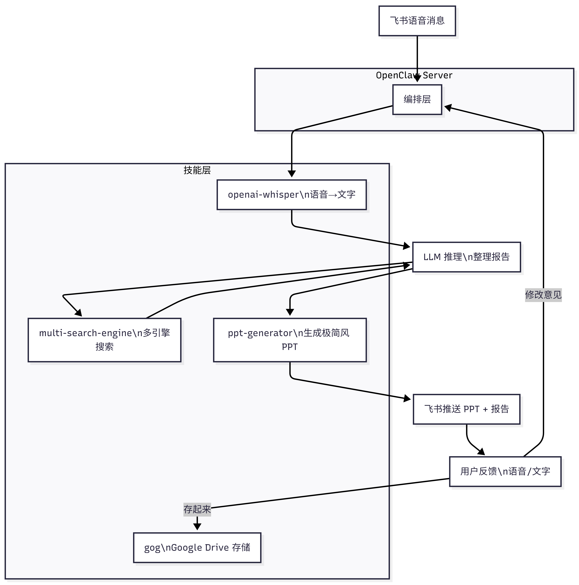
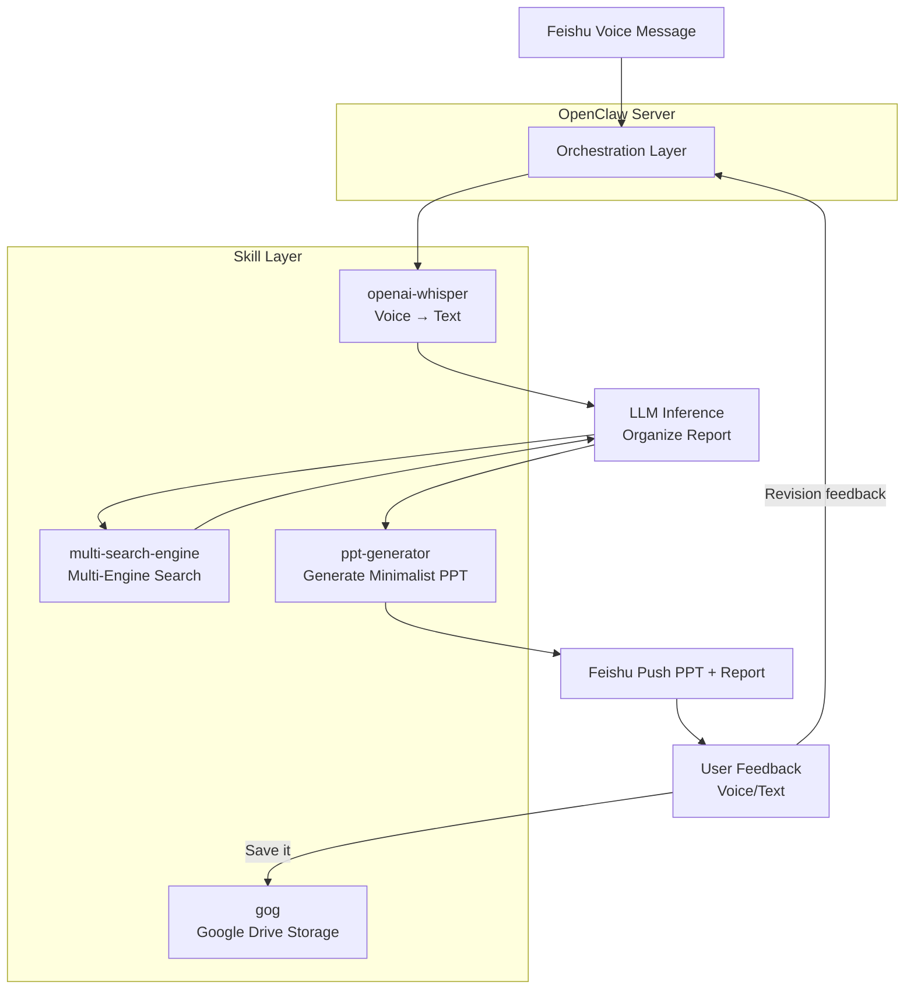

# 🧪 Lobster University: Voice Research in Practice (Just Say It, Get a Report)

> **Use cases**: You're driving and suddenly want to research a topic but can't type; you're on a walk when inspiration strikes and want AI to gather materials and turn them into a PPT; after a team brainstorm, you want to quickly turn the discussion conclusions into a data-backed research document. **All you need to do is say one sentence into your phone, and Lobster searches, builds the PPT, and saves it for you.**

The core idea behind voice research is **using your voice instead of a keyboard**: you only need to "say clearly what you want to research," and leave the rest to AI. OpenClaw receives Feishu voice messages and transcribes them (Whisper), calls a multi-engine search to collect information (multi-search-engine), uses an LLM to organize everything into a structured report and generates a minimalist PPT (ppt-generator), then pushes it to Feishu for you to review. If you're not satisfied with the content, give more voice feedback and Lobster iterates until you say "save it," at which point it archives everything to Google Drive in one click.

---

## 1. What You'll Get (Real-World Value)

Once this is running, you'll have an **on-demand research assistant**:

### Scenario 1: Launch a Research Task with One Sentence While Driving
- **Problem**: You hear an industry update during your commute and want to dig deeper, but can't type
- **Solution**: Send a voice message on Feishu: "Help me research the latest developments in AI Agent enterprise adoption," and Lobster automatically transcribes, searches, and generates a PPT — when you get to the office, open Feishu or Google Drive and it's ready

### Scenario 2: Multi-Round Feedback, Going Deeper
- **Problem**: The first draft report is too broad; you want to add competitor comparisons or data support
- **Solution**: Reply by voice: "Add a specific product comparison for Anthropic, OpenAI, and Google," and Lobster searches again, adds content, and updates the PPT until you're satisfied

### Scenario 3: Capturing Ideas While Walking
- **Problem**: You think of a research topic while jogging/walking but forget it by the time you get home
- **Solution**: Immediately send a voice message to Lobster: "Help me research the 2026 market size and top players in the low-code platform space" — by the time you get home, the PPT is already waiting in Feishu and Google Drive

### Scenario 4: Quickly Producing a Research Document After a Meeting
- **Problem**: After a meeting, the boss says "Give me a research report on XX by this afternoon" and you have no time to start from scratch
- **Solution**: Send the core question by voice after the meeting ends; Lobster generates an initial PPT and report within 10 minutes, and you polish it from there

---

## 2. Skill Selection: Why These Are the "Minimum Viable Set"?

### Core Architecture

<!--  -->




### Install Skills

```bash
clawhub install skill-vetter          # Security guard (must be installed first)
clawhub install openai-whisper        # Core: voice-to-text
clawhub install multi-search-engine   # Core: multi-engine search
clawhub install ppt-generator         # Core: generate minimalist PPT
clawhub install gog                   # Core: Google Drive storage
```

### Why These 5?

| Skill | Irreplaceability | Risk of Alternatives |
|-------|-----------------|----------------------|
| **skill-vetter** | Automatically scans skills for API Key theft | Without it, malicious skills may steal your credentials |
| **openai-whisper** | Runs locally, works offline, supports Chinese-English mixed recognition, no API cost | Online STT services have privacy risks and are billed by usage |
| **multi-search-engine** | Unified interface for 17 search engines, covers both Chinese and English, completely free | A single search engine has insufficient coverage, degrading research quality |
| **ppt-generator** | One-click generation of Jobs-style minimalist tech vertical HTML presentations, directly previewable in Feishu | Manual PPT layout is time-consuming and hard to operate on mobile |
| **gog** | Full Google Drive + Docs integration, supports create/upload/share | Manually copying to cloud storage cannot be automated |

> **Important prerequisite**: Voice transcription requires Whisper CLI installed on the OpenClaw server, so the tools profile must be set to `coding` or `full` (the default `messaging` profile does not support command execution). See [Chapter 7: Tools and Scheduled Tasks](/en/adopt/chapter7/).

> **Can't access Google?** This tutorial uses `gog` (Google Drive) as the storage solution. If you're in mainland China without a network proxy, you can replace `gog` with the `feishu-doc` skill to save reports and PPTs to Feishu Docs, or simply save them as local files. All steps involving Google Drive can be substituted accordingly — this won't be repeated again.

---

## 3. Configuration Guide: Complete Flow from Installation to Working

### 3.1 Prerequisites

| Condition | Description | Reference |
|-----------|-------------|-----------|
| Feishu channel configured | OpenClaw connected to Feishu, able to send/receive messages | [Chapter 4: Chat Platform Integration](/en/adopt/chapter4/) |
| Tools profile set to coding/full | OpenClaw Agent needs command execution permissions | [Chapter 7: Tools and Scheduled Tasks](/en/adopt/chapter7/) |
| Python >= 3.10 installed on server | Required for Whisper to run | — |
| Google OAuth credentials configured | gog skill needs Google Drive access | Section 3.3 below |

### 3.2 Whisper Installation and Verification

**macOS (Homebrew)**:

```bash
brew install openai-whisper
```

**Linux / WSL2 (pipx, recommended)**:

```bash
# Install ffmpeg (Whisper dependency)
sudo apt update && sudo apt install -y ffmpeg

# Install Whisper with pipx (avoids polluting system Python)
sudo apt install -y pipx
pipx install openai-whisper
```

<details>
<summary>Why not use pip install?</summary>

Linux distributions with Python 3.12+ (Ubuntu 24.04, Debian 12, etc.) have [PEP 668](https://peps.python.org/pep-0668/) protection enabled by default, and running `pip install` directly will produce an `externally-managed-environment` error. `pipx` automatically creates an isolated virtual environment — both safe and convenient.

If you prefer to manage virtual environments manually:

```bash
python3 -m venv ~/.venvs/whisper
source ~/.venvs/whisper/bin/activate
pip install -U openai-whisper
```

</details>

<details>
<summary>Windows installation</summary>

On Windows, it is recommended to install inside WSL2 following the Linux steps above. Alternatively, use Conda:

```bash
conda install -c conda-forge openai-whisper
```

</details>

Verify the installation:

```bash
whisper --help
```

> **The first run will download the model** (default `turbo`, approximately 1.5 GB), after which it works offline. If your network is slow, you can manually download the model to `~/.cache/whisper/` beforehand.

### 3.3 Google Drive Configuration (gog)

If you've already configured gog in another tutorial, you can skip this step.

The gog skill requires three steps: install the gog CLI → create Google OAuth credentials → authorize login.

```bash
# Install gog CLI
brew install steipete/tap/gogcli

# Verify
gog --version
```

<details>
<summary>Complete Google OAuth configuration process (required reading for first-time setup)</summary>

**Step 1: Enable Google APIs**

1. Visit [Google Cloud Console](https://console.cloud.google.com/) and log in with your Google account
2. Create or select a project
3. In **APIs & Services → Library**, search for and enable: Gmail API, Google Calendar API, Google Drive API, Google Sheets API, Google Docs API, Google Slides API

<!--  -->

<!--  -->

**Step 2: Configure OAuth Consent Screen**

1. Go to **Google Auth platform → Branding**, fill in the App name (e.g., "gog-cli") and your email
2. Set Audience to **External**
3. Under **Audience → Test users**, add your Gmail address

**Step 3: Create Credentials**

1. Go to **Google Auth platform → Clients** → **Create Client**
2. Set Application type to **Desktop app**, then click Create
3. Download the `client_secret_xxx.json` file and store it in a safe location (e.g., `~/.config/gog/`)

> **Remote server**: If OpenClaw runs on a remote server, create the directory on the server first, then upload the credentials:
> ```bash
> # Remote server: create directory
> ssh user@your-server "mkdir -p ~/.config/gog"
> # Run locally: upload credentials to remote server
> scp client_secret_xxx.json user@your-server:~/.config/gog/
> ```

**Step 4: Authorize Login**

```bash
# Import credentials (use the actual file path)
gog auth credentials ~/.config/gog/client_secret_xxx.json
```

> **Required reading for remote servers**: `gog auth add` starts a temporary HTTP server on the local machine to receive Google's OAuth callback. But `127.0.0.1` on a remote server is not the machine where your browser is running, so the callback will inevitably fail (`ERR_CONNECTION_REFUSED`). This must be resolved via SSH port forwarding — **follow these steps in order**:
>
> ```bash
> # ⓪ Remote server (run once only): headless Linux has no desktop keyring, must switch to file storage
> gog config set keyring_backend file
>
> # ① Remote server: run the auth command (don't close it! replace with your Gmail address)
> gog auth add your-email@gmail.com --services gmail,calendar,drive,contacts,sheets,docs,slides
>
> # It outputs a long URL with the port number hidden in the redirect_uri parameter:
> # ...redirect_uri=http%3A%2F%2F127.0.0.1%3A44261%2Foauth2%2Fcallback...
> #                                          ^^^^^
> #                                     This is the port (random each time, 44261 in this example)
>
> # ② Local machine: open another terminal and create an SSH tunnel using the port from ① (do this within 30 seconds!)
> ssh -L 44261:localhost:44261 user@your-server
>
> # ③ Local browser: paste the full URL from ①, complete the Google authorization
> # The Google account you log in with must match the email in ①, otherwise an email mismatch error will occur
> # The callback goes through the SSH tunnel to the remote server, and the ① process automatically completes authorization
> ```
>
> **Notes**:
> - `%3A` is the URL encoding of `:`, so `127.0.0.1%3A44261` means `127.0.0.1:44261`
> - The port changes every time — you must build the tunnel using the actual port from the output
> - The temporary HTTP server in gog has a timeout: from seeing the port number to opening the browser, **do not exceed 30 seconds**, otherwise you need to re-run ①
> - If you encounter `store token: Object does not exist at path "/"`, it means ⓪ (keyring configuration) was not run
> - After successful authorization, gog will prompt `Enter passphrase to unlock keyring` — this is the encryption password for the file keyring, **set it on first use, and it will be required for every subsequent `gog` operation**. Remember this password; if lost, you must delete `~/.config/gogcli/keyring` and re-authorize
> - Occasional `channel N: open failed: connect failed: Connection refused` messages in the SSH tunnel terminal are normal (browser retry attempts) and do not affect the authorization result

If OpenClaw runs on your **local machine**, run this directly:

```bash
gog auth add your-email@gmail.com --services gmail,calendar,drive,contacts,sheets,docs,slides
```
<!--


 -->


Verify:

```bash
gog auth list
```
Set the default account:

```bash
export GOG_ACCOUNT=you@gmail.com
echo 'export GOG_ACCOUNT=you@gmail.com' >> ~/.bashrc
```

</details>

### 3.4 Enable Command Execution Permissions

```bash
openclaw config set tools.profile coding
```

### 3.5 Write Workspace Rules (IDENTITY.md)

Append the following content to `~/.openclaw/workspace/IDENTITY.md` so OpenClaw knows how to coordinate the skills when it receives a research task:

```markdown
## Scenario Handling — Voice Research Requests

When the user sends a voice message with content related to research, investigation, or analysis:
1. Use openai-whisper to transcribe the voice to text
2. Extract the research topic and key questions from the transcription
3. Use multi-search-engine to collect information from at least 3 search engines (preferred: Google + Baidu + DuckDuckGo)
4. Organize the search results into a structured research report with the following format:
   ## Research Topic
   ## Summary (3-5 sentences summarizing core findings)
   ## Detailed Findings (organized by topic with source links)
   ## Data & Charts (use tables for any quantitative data)
   ## Conclusions & Recommendations
   ## References (all links consolidated)
5. Use ppt-generator to generate a Jobs-style minimalist tech vertical HTML presentation from the report
6. Send the PPT file and report summary to Feishu, and ask the user for feedback
7. If the user says "save it" / "store it" / "archive it":
   - Use gog to create a folder in Google Drive, upload the PPT and report, with filename format: `Research-Report-{Topic}-{Date}`
   - Reply to the user with the Google Drive document link
8. If the user provides revision feedback:
   - Conduct additional searches based on feedback (call multi-search-engine again)
   - Update the report content and regenerate the PPT
   - Resend to Feishu
   - Repeat until the user is satisfied
```

---

## 4. First Run: From Manual Verification to Full Automation

### 4.1 Server Self-Check (30 Seconds)

```bash
whisper --help              # Whisper CLI is installed
gog auth list               # Google Drive authentication is working
openclaw doctor             # OpenClaw overall health check
clawhub list --active       # Confirm all four skills are active
```

If all five commands pass, you're ready to send your first voice message. If any fail, jump to Section 6 for troubleshooting.

### 4.2 Text Test (Verify the Text Pipeline First)

> **It is recommended to test with text first**, confirming that the search + report generation + Google Drive storage pipeline all work correctly before adding the voice step.

Send a text message in Feishu:

```text
Please help me research "The 2026 OpenClaw Market Landscape":
1) Search for relevant information using at least 3 search engines
2) Organize into a structured report including: summary, major players, market size, technology trends, and references
3) Generate a minimalist PPT
4) Send the PPT and report to me on Feishu
```

After confirming you received the PPT, reply:

```text
The PPT looks good. Please add the following:
1) A comparison of Anthropic and OpenAI's Agent products
2) Key players in the Chinese market
```

After confirming the PPT is updated, reply:

```text
That works. Save it to Google Drive.
```

Confirm you receive the Google Drive document link, click to open it, and verify the PPT and report content are complete.

### 4.3 Voice Test (Full Pipeline)

After the text pipeline is working, send a **voice message** in Feishu:

> "Help me research the 2026 market size and major players in the low-code platform space, focusing on the domestic market."

Observe whether Lobster:
1. Correctly transcribed the voice content (confirm that key terms were not misrecognized)
2. Called multiple search engines
3. Generated a structured report
4. Generated a minimalist PPT (an HTML file, directly previewable in Feishu)
5. Included source links in the report and PPT

> **Chinese-English mixed recognition**: Whisper handles Chinese-English mixed speech well (e.g., "Help me look up the LLM benchmark"). If a technical term is misrecognized, correct it in a follow-up voice message: "What I said earlier was L-L-M, large language model."

### 4.4 Next Steps

Once the basic pipeline is working, you can gradually upgrade:
- Refine report templates and PPT styles in IDENTITY.md (by industry/academic/competitor analysis scenarios, etc.)
- Configure Cron scheduled research (e.g., automatically generate an industry update PPT every Monday)
- Save the PPT and report to both Feishu Docs and Google Drive simultaneously (dual backup)

---

## 5. Advanced Scenarios: From "Works" to "Works Well"

### Scenario 1: Academic Literature Research

Describe your academic research need by voice, and Lobster will adjust its search strategy (prioritizing academic sources like Google Scholar):

```
Help me research the latest advances in applying Transformer architecture
to time series forecasting, focusing on papers from 2025-2026,
including method comparisons and performance metrics.
```

> **Tip**: Add an academic research template to IDENTITY.md specifying that the output format should include fields like "paper title, authors, publication date, core method, experimental results" — this significantly improves report quality.

### Scenario 2: Competitor Analysis Report

```
Help me create a competitor analysis: compare three products — Notion AI, Cursor, and Claude Code —
across four dimensions: pricing, target users, core features, and technical architecture,
presented in a table format.
```

Lobster will search for information on each product separately, cross-verify it, and then generate a comparison table.

### Scenario 3: Scheduled Industry Briefing

Configure a Cron task to automatically push an industry update every Monday morning:

```bash
openclaw cron add --name "Weekly Industry Briefing" --cron "0 9 * * 1" --message "Please research the important developments in the AI Agent space from the past week: 1) Search Google, Baidu, and Hacker News 2) Organize into a briefing format: this week's headlines (3-5 items), noteworthy products/papers, industry trend analysis 3) Generate a minimalist PPT 4) Push the PPT to Feishu 5) Also save to a 'Weekly Reports' folder in Google Drive"
```

### Scenario 4: Multi-Round Deep Research (Follow-up Mode)

After the first round provides an overview, progressively dig deeper by voice:

```
Round 1 (voice): "Help me research AI applications in medical imaging diagnosis"
→ Lobster: Returns overview PPT + report

Round 2 (voice): "Good, now focus on the lung CT screening direction and add FDA approval status"
→ Lobster: Searches for more, updates PPT and report

Round 3 (voice): "Also add domestic policies and regulations and the top companies in China"
→ Lobster: Searches Chinese sources again, updates PPT and report

Round 4 (text): "That's good, save it to Google Drive, file name 'AI-Medical-Imaging-Research-2026Q1'"
→ Lobster: Saves PPT and report and returns the link
```

> **Tip**: Each round, Lobster retains the context from previous searches and doesn't lose existing content. If the context becomes too long and causes omissions, send `/compact` to have Lobster compress the conversation history.

---

## 6. Common Issues and Troubleshooting

### Issue 1: Voice Recognition Is Inaccurate

**Diagnostic steps**:

1. Check if Whisper is installed:
   ```bash
   whisper --help
   ```

2. Manually test transcription:
   ```bash
   # Download the Feishu voice file then test manually
   whisper /path/to/audio.m4a --model turbo --language zh
   ```

3. Check OpenClaw logs:
   ```bash
   openclaw logs --limit 50
   ```

**Common causes**:
- Model too small — the default `turbo` is suitable for most scenarios; if recognition accuracy is low, try `medium` or `large` (slower but more accurate)
- Loud background noise — try to record in a quiet environment or speak closer to the microphone
- Frequent Chinese-English switching — Whisper handles Chinese-English mixing well, but very short English words may occasionally be misrecognized as Chinese

### Issue 2: Poor Search Result Quality

**Diagnostic steps**:

1. Manually test search:
   ```
   Please use Google to search for "AI Agent 2026" and return the title and link of the top 5 results
   ```

2. Check network connectivity (some search engines require a proxy)

**Common causes**:
- Search keywords too broad — the raw Whisper transcription may not be suitable as search terms directly; the LLM should first refine the keywords
- Only one search engine used — make sure IDENTITY.md specifies "at least 3 search engines"
- Chinese search engines ignored — when researching Chinese topics, make sure Baidu and Sogou are included

### Issue 3: Google Drive Storage Fails

**Diagnostic steps**:

1. Check gog authentication status:
   ```bash
   gog auth list
   ```

2. Manually test Drive operations:
   ```bash
   gog drive search "test" --max 5
   ```

**Common causes**:
- OAuth Token expired — re-run `gog auth add you@gmail.com --services gmail,calendar,drive,contacts,sheets,docs,slides`
- Google API quota exhausted — check API usage in [Google Cloud Console](https://console.cloud.google.com/)
- Network proxy issue — make sure the OpenClaw process also routes through the proxy (set the `http_proxy` environment variable)

### Issue 4: Feishu Voice Messages Not Received

**Common causes**:
- Feishu bot does not have "receive messages" permission — check the permission settings on the Feishu Open Platform
- Voice message format not supported — make sure you're sending a voice message in Feishu (press and hold to record), not voice-to-text
- OpenClaw not configured for file downloads — voice messages require downloading the audio file before transcription; make sure OpenClaw has write permission to the filesystem

---

## 7. Advanced Usage: Building Your Voice Research System

### Tip 1: Customize Report Templates by Scenario

Pre-define templates in IDENTITY.md for different research scenarios:

```markdown
### Research Report Templates

**Industry Research Template**:
- Market size and growth rate
- Upstream and downstream of the supply chain
- Key players and market share
- Technology trends
- Policy environment
- Investment recommendations

**Competitor Analysis Template**:
- Product positioning comparison (table)
- Feature comparison matrix (table)
- Pricing strategy comparison
- User review summary
- Strengths and weaknesses summary

**Technology Research Template**:
- Overview of technical principles
- Comparison of mainstream approaches
- Recommended open-source projects
- Performance benchmarks
- Applicable scenarios and limitations
```

When using it, just say by voice "Use the competitor analysis template to compare X and Y," and Lobster knows which format to output in.

### Tip 2: Automatic Organization of Research Archives

```
Please help me create the following folder structure in Google Drive:
- Research Reports/
  - Industry Research/
  - Competitor Analysis/
  - Technology Research/
  - Weekly Briefings/

When saving future reports, automatically categorize them into the appropriate folder based on content.
```

### Tip 3: Search Engine Combination Strategy

Specify search engine combinations for different research types in IDENTITY.md:

```markdown
### Search Engine Strategy

- **Chinese market research**: Baidu + Sogou + Toutiao + Google (Chinese)
- **International market research**: Google + DuckDuckGo + Brave
- **Academic research**: Google + DuckDuckGo (site:arxiv.org) + DuckDuckGo (site:scholar.google.com)
- **Product research**: Google + Baidu + DuckDuckGo (site:reddit.com)
- **News and current events**: Google (tbs=qdr:d) + Baidu + Toutiao
```

---

## 8. Performance Optimization Tips

### Optimization 1: Choose the Right Whisper Model

| Model | Size | Speed | Accuracy | Use Case |
|-------|------|-------|----------|----------|
| `tiny` | 39 MB | Fastest | Low | Quick drafts, details don't matter |
| `base` | 74 MB | Fast | Fair | Short everyday voice messages |
| `small` | 244 MB | Medium | Good | Most scenarios |
| `medium` | 769 MB | Slower | Very good | Scenarios with many technical terms |
| `turbo` | 1.5 GB | Medium | Excellent | **Recommended default** |
| `large` | 2.9 GB | Slowest | Best | Maximum accuracy required |

> **Recommendation**: Use `turbo` for everyday use (best balance of speed and accuracy). If server performance is limited, use `small`.

### Optimization 2: Limit the Number of Search Engines

You don't need to search all 17 engines every time. Selecting 3-5 per scenario is sufficient:

```
Please only use Google, Baidu, and DuckDuckGo for this search (to reduce wait time)
```

### Optimization 3: Control Report Length

```
Keep the report under 1,500 words, focus on key points, don't try to cover everything
```

**Why**: Overly long reports consume a large portion of the context window, degrading the quality of subsequent multi-round feedback.

### Optimization 4: Use Advanced Search Syntax

multi-search-engine supports advanced search operators, which can significantly improve result quality:

```
Use the following advanced syntax when searching:
- "AI Agent" for exact match
- site:arxiv.org to limit to academic sources
- filetype:pdf to find report documents
- -advertisement -sponsored to exclude marketing content
```

---

## 9. Security and Compliance Reminders

### Reminder 1: Privacy Protection for Voice Data

**Important**: Whisper runs locally — voice data **is never uploaded to any cloud server**. This is the core reason for choosing openai-whisper over online STT services.

However, note that:
- When Feishu transmits voice messages, the data passes through Feishu's servers
- The transcribed text is sent to an LLM for processing
- Do not include sensitive information such as passwords or bank card numbers in voice messages

### Reminder 2: Reliability of Search Results

**AI-generated research reports may contain**:
- Outdated information (search results can lag by hours to days)
- Unreliable sources (some search results may come from low-quality websites)
- Data errors (the LLM may misinterpret or incorrectly integrate search results)

**Recommendations**:
1. Always verify the original source links for important reports
2. For any cited data, click the source link to verify accuracy
3. Before use in formal settings, conduct at least one manual review pass

### Reminder 3: Google Drive Permission Management

- gog's OAuth Token has Drive read/write access — keep it secure
- Regularly check `gog auth list` and remove authorizations no longer in use
- Research reports are private by default; set sharing permissions manually when needed

---

## 10. Summary: From "Thinking It" to "Seeing It"

The core value of voice research is **eliminating the friction between an idea and a PPT** — all you need to do is open your mouth, and the Agent handles everything else:

- **Anytime, anywhere**: While driving, walking, or after a meeting, send a request by voice
- **Multi-round iteration**: Not satisfied? Keep talking — Lobster searches and updates the PPT for you
- **Automatic archiving**: When satisfied, say "save it" and the PPT and report automatically go to Google Drive
- **Completely free**: Whisper runs locally, multi-search-engine has no API fees, ppt-generator generates locally, and Google Drive storage is free

**Architectural philosophy**: Let each component do what it does best — Whisper handles transcription, multi-search-engine handles information gathering, LLM handles content synthesis, ppt-generator handles the presentation, and gog handles document storage. No complex workflow orchestration needed; OpenClaw's Agent loop naturally supports multi-round conversation.

**Remember**: Good research isn't about how much information you search for — it's about **asking the right questions**. Voice research lets you focus your attention on "what to ask," and leaves the searching, organizing, PPT creation, and storage entirely to Lobster.

## References

### Voice Transcription
- [OpenAI Whisper (Open-source Speech Recognition)](https://github.com/openai/whisper)
- [openai-whisper ClawHub Skill](https://clawhub.ai/steipete/openai-whisper)
- [Whisper Model List and Performance Comparison](https://github.com/openai/whisper#available-models-and-languages)

### Search Engines
- [multi-search-engine ClawHub Skill](https://clawhub.ai/gpyAngyoujun/multi-search-engine)
- [DuckDuckGo Bangs (Quick Search Commands)](https://duckduckgo.com/bangs)
- [Google Advanced Search Operators](https://support.google.com/websearch/answer/2466433)

### PPT Generation
- [ppt-generator ClawHub Skill](https://clawhub.ai/ppt-generator) — One-click generation of Jobs-style minimalist tech vertical HTML presentations

### Google Workspace
- [gog ClawHub Skill](https://clawhub.ai/steipete/gog)
- [gog CLI Official Site](https://gogcli.sh)
- [Google Cloud Console](https://console.cloud.google.com/)
